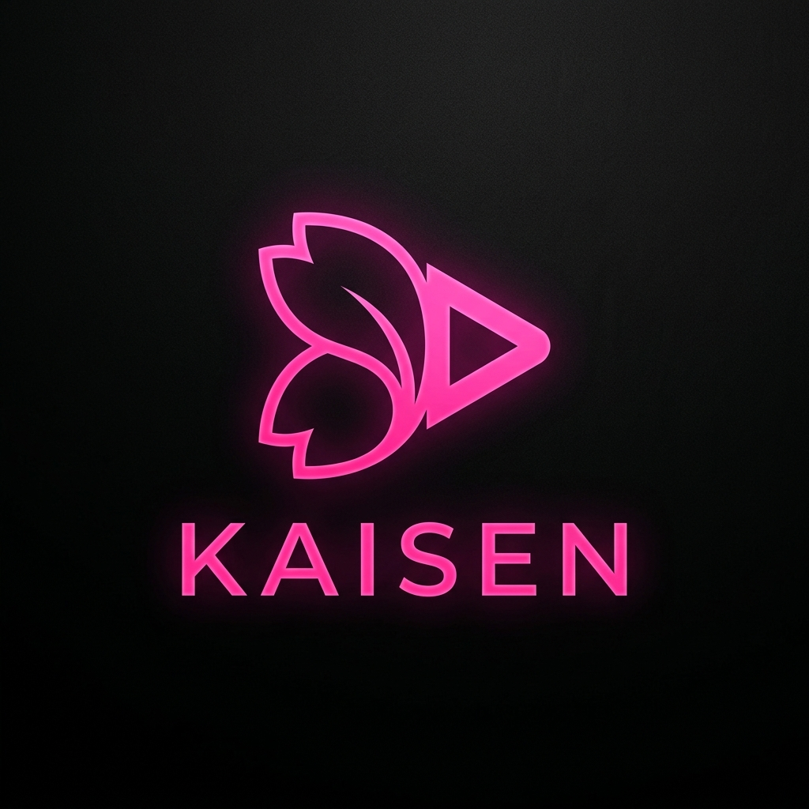
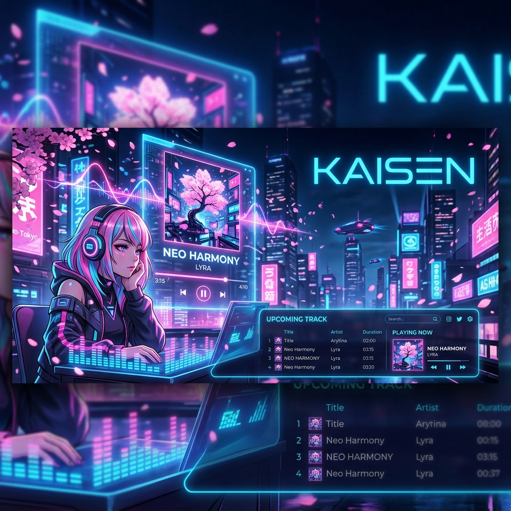

<div align="center">
  
  <h1>Kaisen</h1>
  <p><strong>A Premium Anime Music Discovery & Streaming Platform</strong></p>

  

  <p>
    
    
    
    
    
  </p>
</div>

---

## 🌸 Overview

**Kaisen** is a state-of-the-art anime music platform designed for enthusiasts who demand a premium experience. Built with a "Sakura Neon" aesthetic, it combines modern web technologies with the power of Google Gemini AI to provide a seamless discovery, organization, and listening experience for anime themes (OPs/EDs) and soundtracks.

## ✨ Key Features

- **🚀 Advanced Search**: Lightning-fast search with infinite scroll support. Filter by anime, artist, or theme type.
- **🎨 Sakura Neon UI**: A custom-designed interface with smooth glassmorphism, vibrant gradients, and fluid micro-animations.
- **📱 Horizontal Exploration**: Intuitively browse through artists and anime series with smooth horizontal scrolling components.
- **📚 Personal Library**: Manage your favorite tracks, create playlists, and track your listening history.
- **🔔 Real-time Notifications**: Stay updated with new releases and activity via a dedicated notification system.
- **🤖 AI-Powered Discovery**: Integrated with Google Gemini to provide smart recommendations and detailed insights into your favorite tracks.
- **🎮 Interactive Quiz**: Test your anime music knowledge with a built-in quiz feature.

## 🛠️ Tech Stack

- **Frontend**: [Next.js 15](https://nextjs.org/) (App Router), [React 19](https://react.dev/)
- **Styling**: [Tailwind CSS 4](https://tailwindcss.com/), [Motion](https://motion.dev/) (Framer Motion)
- **Database**: [MongoDB](https://www.mongodb.com/) with [Mongoose](https://mongoosejs.com/)
- **AI Integration**: [Google Gemini Pro](https://ai.google.dev/)
- **Data Fetching**: [TanStack Query v5](https://tanstack.com/query/latest)
- **Authentication**: JWT & Bcryptjs
- **Icons**: [Lucide React](https://lucide.dev/)

## 🚀 Getting Started

### Prerequisites

- [Node.js](https://nodejs.org/) (Latest LTS recommended)
- [MongoDB](https://www.mongodb.com/try/download/community) instance (Local or Atlas)
- [Gemini API Key](https://aistudio.google.com/app/apikey)

### Installation

1. **Clone the repository:**
   ```bash
   git clone https://github.com/zadidsalman/kaisen.git
   cd kaisen
   ```

2. **Install dependencies:**
   ```bash
   npm install
   ```

3. **Environment Setup:**
   Create a `.env` file in the root directory and add your credentials (refer to `.env.example`):
   ```env
   MONGODB_URI=your_mongodb_uri
   GEMINI_API_KEY=your_gemini_api_key
   JWT_SECRET=your_jwt_secret
   ```

4. **Seed the Database (Optional):**
   ```bash
   npm run seed:all
   ```

5. **Run the development server:**
   ```bash
   npm run dev
   ```

## 📂 Project Structure

```text
├── app/               # Next.js App Router (Pages & API)
├── components/        # Reusable UI components
├── hooks/             # Custom React hooks
├── lib/               # Utility functions, DB connection, & Models
├── providers/         # Context & Third-party providers
├── public/            # Static assets
├── scripts/           # DB seeding & migration scripts
└── types/             # TypeScript definitions
```

## 🤝 Contributing

Contributions are welcome! Please feel free to submit a Pull Request.

## 📄 License

This project is licensed under the MIT License - see the [LICENSE](LICENSE) file for details.

---

<div align="center">
  <p>Built with ❤️ for the Anime Community</p>
</div>
